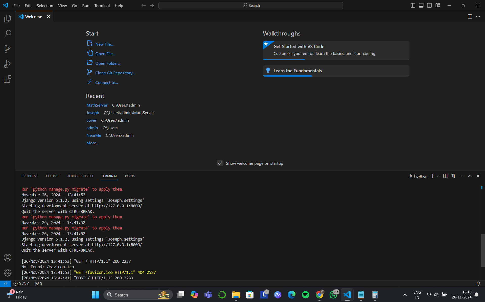
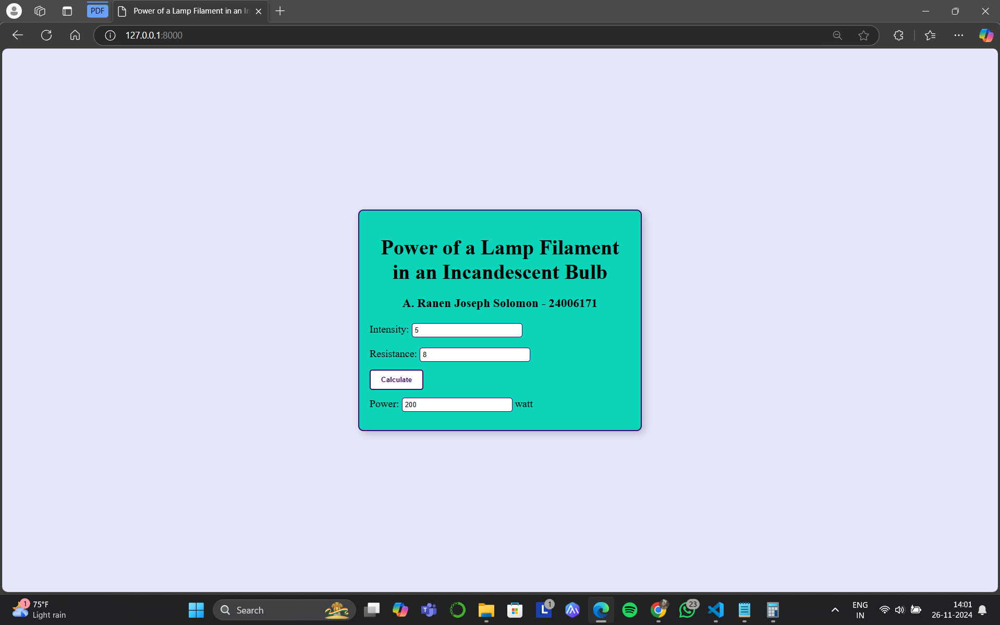

# Ex.05 Design a Website for Server Side Processing
## Date:26.11.2024

## AIM:
 To design a website to calculate the power of a lamp filament in an incandescent bulb in the server side. 


## FORMULA:
P = I<sup>2</sup>R
<br> P --> Power (in watts)
<br> I --> Intensity
<br> R --> Resistance

## DESIGN STEPS:

### Step 1:
Clone the repository from GitHub.

### Step 2:
Create Django Admin project.

### Step 3:
Create a New App under the Django Admin project.

### Step 4:
Create python programs for views and urls to perform server side processing.

### Step 5:
Create a HTML file to implement form based input and output.

### Step 6:
Publish the website in the given URL.

## PROGRAM :
math.html
```
<!DOCTYPE html>
<html>
<head>
<meta charset='utf-8'>
<meta http-equiv='X-UA-Compatible' content='IE=edge'>
<title>Power of a Lamp Filament in an Incandescent Bulb</title>
<meta name='viewport' content='width=device-width, initial-scale=1'>
<style type="text/css">
body {
    background-color: lavender;
    margin: 0;
    height: 100vh;
    display: flex;
    justify-content: center;
    align-items: center;
}
.box {
    border: solid 2px rgb(59, 8, 116);
    width: 500px;
    min-height: 300px;
    font-size: 20px;
    background-color: rgb(11, 212, 185);
    text-align: center;
    padding: 20px;
    box-shadow: 5px 5px 15px rgba(0, 0, 0, 0.2);
    border-radius: 10px;
}
.formelt {
    color: black;
    margin-top: 10px;
    margin-bottom: 10px;
    text-align: left;
}
h1, h3 {
    color: black;
    margin-bottom: 20px;
}
input[type="text"] {
    width: 200px;
    padding: 5px;
    margin: 5px 0;
    border: 1px solid rgb(59, 8, 116);
    border-radius: 5px;
}
input[type="submit"] {
    padding: 10px 20px;
    background-color: white;
    color: rgb(59, 8, 116);
    border: 2px solid rgb(59, 8, 116);
    border-radius: 5px;
    cursor: pointer;
    font-weight: bold;
}
input[type="submit"]:hover {
    background-color: rgb(59, 8, 116);
    color: white;
}
</style>
</head>
<body>
<div class="box">
    <h1>Power of a Lamp Filament in an Incandescent Bulb</h1>
    <h3>A. Ranen Joseph Solomon - 24006171</h3>
    <form method="POST">
        
        <div class="formelt">
            <label for="intensity">Intensity:</label>
            <input type="text" id="intensity" name="intensity" value="{{ i }}"> 
        </div>
        <div class="formelt">
            <label for="resistance">Resistance:</label>
            <input type="text" id="resistance" name="resistance" value="{{ r }}"> 
        </div>
        <div class="formelt">
            <input type="submit" value="Calculate">
        </div>
        <div class="formelt">
            <label for="power">Power:</label>
            <input type="text" id="power" readonly value="{{ power }}"> watts
        </div>
    </form>
</div>
</body>
</html>
```
urls.py
```
from django.contrib import admin
from django.urls import path
from mathapp import views

urlpatterns = [
    path('admin/', admin.site.urls),
    path('poweroflamp/', views.power, name="power"),
    path('', views.power, name="powerofincandescentlamp"),
]
```
views.py
```
from django.shortcuts import render
def power(request):
    context = {}  
    context['power']="0"
    context['i']="0"
    context['r']="0"
    if request.method == 'POST':
        print("POST method is used")
        i = request.POST.get('intensity', '0')
        r = request.POST.get('resistance', '0')
        print('request=',request)
        print('Intensity',i)
        print('Resistance',r)
        power = int(i)**2 * int(r)
        context['power'] = power
        context['i'] = i
        context['r'] = r
        print('Power=',power)
    return render(request, 'mathapp/math.html', context)
```


## SERVER SIDE PROCESSING:


## HOMEPAGE:


## RESULT:
The program for performing server side processing is completed successfully.
